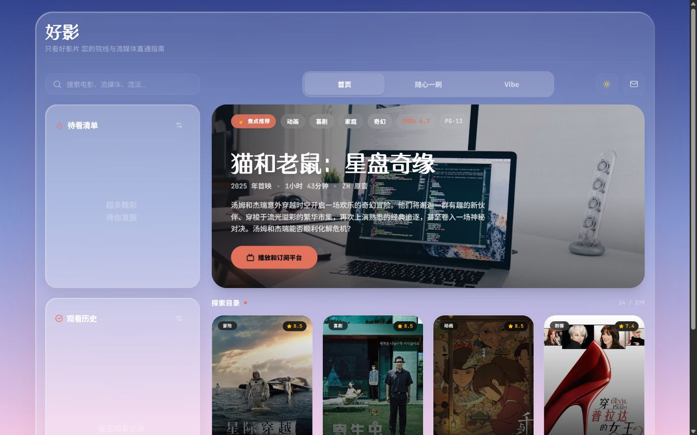
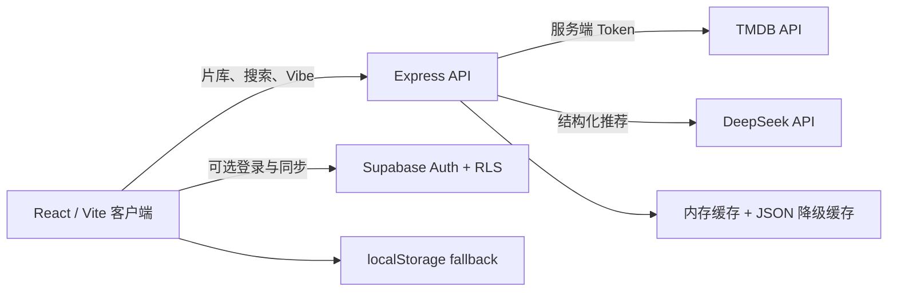

<div align="center">
  
  <h1>好影 Hooyi</h1>
  <p>从片库筛选、随心一刷到 Vibe 情绪推荐，找到此刻真正想看的电影。</p>

  [](https://github.com/crake7even/hooyi/actions/workflows/ci.yml)
  [](https://www.typescriptlang.org/)
  [](https://react.dev/)
  [](LICENSE)
  [](https://hooyi.netlify.app/)
</div>



## 在线体验

- Web：[https://hooyi.netlify.app](https://hooyi.netlify.app/)
- API Health：[https://hooyi.onrender.com/health](https://hooyi.onrender.com/health)

> Render 免费实例休眠后，首次请求可能需要等待冷启动。线上环境只用于作品集演示，不应放入真实账户或敏感数据。

## 项目简介

Hooyi 是一个面向“选择困难”场景的电影发现应用。它将 TMDB 实时片库、流媒体平台信息、可解释的本地排序和 DeepSeek 情绪推荐组合在一起，同时提供无账号本地使用与可选 Supabase 云端同步。

核心目标不是再做一个电影列表，而是把“我现在适合看什么”转化为可以筛选、可以解释、可以继续反馈的产品流程。

## 核心功能

- **动态片库**：聚合 TMDB 热门、高分、上映中和多语言类型片单，带文件缓存与降级策略。
- **多维筛选**：支持关键词、类型、年份、评分、语言、播放平台和个性化热度排序。
- **随心一刷**：用卡片手势表达喜欢、跳过和加入待看，持续更新类型偏好分数。
- **Vibe 推荐**：根据自然语言描述与当前筛选条件生成结构化推荐，并校验结果必须来自真实候选片库。
- **账号同步**：Supabase 可选接入，使用 Row Level Security 保存待看、历史和偏好；未配置时自动使用 localStorage。
- **响应式体验**：桌面侧栏与移动端折叠资料库共用一套数据状态，支持明暗主题和键盘操作。

## 架构



### 关键数据流

1. 前端先加载内置/静态缓存，保证接口冷启动或短暂故障时仍有内容。
2. Express 在后台刷新 TMDB 数据，API Key 只存在于服务端环境变量。
3. Vibe 请求最多携带 60 部经过字段裁剪的候选影片；服务端再次校验、限流并过滤演示不适宜内容。
4. DeepSeek 返回 JSON 后，服务端按 `movieId/title` 回查真实片库；解析失败时使用本地评分算法降级。

## 工程设计

- **Secret boundary**：TMDB 与 DeepSeek 凭据没有 `VITE_` 前缀，不进入浏览器 bundle。
- **Cost control**：`/api/vibe` 有请求体上限、消息长度限制、固定窗口 IP 限流和上游 timeout。
- **Resilience**：TMDB 片库使用 stale-while-refresh 思路，缓存刷新异常时继续使用上一次完整数据。
- **Data isolation**：Supabase 四张用户表启用 RLS，策略只允许访问 `auth.uid()` 对应的数据。
- **Safe demo mode**：默认启用 `DEMO_SAFE_MODE`，缓存生成、搜索和 Vibe 候选池共用内容过滤规则。
- **Reproducibility**：Node 22、锁文件、GitHub Actions、Node Test Runner 与生产构建组成统一检查链。

## 技术栈

| 层级 | 技术 |
|---|---|
| Frontend | React 19、TypeScript、Vite、Tailwind CSS、Motion、Lucide |
| Backend | Express、Node.js、Undici、esbuild |
| Data / AI | TMDB API、DeepSeek API |
| Optional persistence | Supabase Auth、PostgreSQL、Row Level Security |
| Deployment | Netlify、Render、GitHub Actions |

## 本地运行

要求：Node.js 22+、npm，以及自己的 TMDB / DeepSeek 开发凭据。不要把 API Key、Token 或 Supabase `service_role` 写入代码、日志或提交历史。

```powershell
git clone https://github.com/crake7even/hooyi.git
Set-Location hooyi
npm.cmd ci
Copy-Item .env.example .env.local
```

编辑 `.env.local`，至少填写：

```dotenv
TMDB_READ_TOKEN="YOUR_TMDB_READ_ACCESS_TOKEN"
DEEPSEEK_API_KEY="YOUR_DEEPSEEK_API_KEY"
```

分别启动后端和前端：

```powershell
# Terminal 1
npm.cmd run api

# Terminal 2
npm.cmd run dev
```

- Frontend：http://localhost:3000
- Backend：http://localhost:3001
- Health：http://localhost:3001/health

## 环境变量

| 变量 | 必需 | 用途 |
|---|---:|---|
| `TMDB_READ_TOKEN` | 是 | 服务端读取 TMDB 数据 |
| `DEEPSEEK_API_KEY` | Vibe 必需 | 服务端生成情绪推荐 |
| `VITE_API_BASE_URL` | 生产必需 | 浏览器访问 Express API 的公开地址 |
| `VITE_SUPABASE_URL` | 否 | 开启账号与云端同步 |
| `VITE_SUPABASE_ANON_KEY` | 否 | Supabase 公共 anon key；不要使用 `service_role` |
| `CORS_ORIGINS` | 生产必需 | 允许访问 API 的前端 Origin，逗号分隔 |
| `DEMO_SAFE_MODE` | 否 | 默认 `true`，过滤演示不适宜内容 |
| `VIBE_RATE_LIMIT` | 否 | 单个 IP 在窗口内的 Vibe 请求数，默认 `10` |
| `VIBE_RATE_WINDOW_MS` | 否 | 限流窗口，默认 `600000` ms |
| `TMDB_TIMEOUT_MS` | 否 | TMDB 请求 timeout，默认 `12000` ms |
| `DEEPSEEK_TIMEOUT_MS` | 否 | DeepSeek 请求 timeout，默认 `25000` ms |
| `API_PROXY_URL` | 否 | 仅本地或明确需要代理的服务端环境使用 |

完整示例见 [`.env.example`](.env.example)。

## 验证

```powershell
npm.cmd run typecheck
npm.cmd test
npm.cmd run build:all
npm.cmd audit
```

也可以一次执行：

```powershell
npm.cmd run check
```

当前测试覆盖输入校验、API 限流、演示内容过滤、电影筛选排序与偏好排序。GitHub Actions 会在 push 到 `main` 或 Pull Request 时执行安全审计、类型检查、测试和双端构建。

## 项目结构

```text
.
├─ .github/workflows/ci.yml    # CI
├─ data/                       # 服务端片库缓存
├─ public/                     # 静态资源与前端降级缓存
├─ scripts/                    # 可重复的数据维护脚本
├─ src/
│  ├─ api/                     # Browser API clients
│  ├─ components/              # UI components
│  └─ App.tsx                  # Application orchestration
├─ tests/                      # Node Test Runner tests
├─ server-safety.ts            # 输入清洗、限流、timeout、内容过滤
├─ server.ts                   # Express API 与推荐流程
└─ supabase-schema.sql         # 表结构与 RLS policies
```

## 已知限制与后续方向

- 当前限流存储在单个 Node 进程内；多实例部署应迁移到 Redis/KV。
- 电影横向目录采用分批渲染而非完整虚拟列表，适合当前 320 部规模；更大数据集应使用窗口化。
- 内容过滤用于作品集安全演示，不替代完整的年龄分级、地区政策和人工审核系统。
- Supabase Schema 面向新项目初始化；正式迁移应改用版本化 migration。

## 数据来源与声明

影片元数据和图片来自 [The Movie Database (TMDB)](https://www.themoviedb.org)，播放平台信息由 [JustWatch](https://www.justwatch.com) 提供。

> This product uses the TMDB API but is not endorsed or certified by TMDB.

详细声明见 [CREDITS.md](CREDITS.md)。
